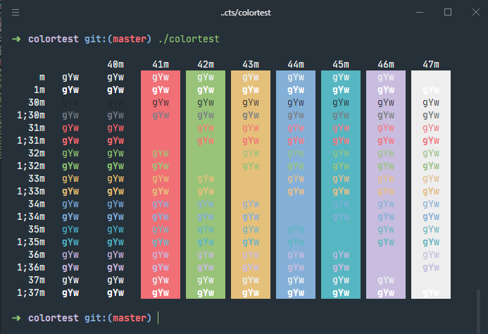

<p align="center">
  
</p>

# Delirium Dark Theme for Hyper Term

<p align="center">
    
    <a href="https://www.linkedin.com/in/mailontorres/">
        
    </a>
    
</p>




### 🚀 Installation

- Use the following command to install the theme.

```bash
$ hyper install hyper-theme-delirium
```

### Manual installation

1. Open Hyper preferences with `Cmd +` or using the menu `File/Edit/Preferences`.
2. Update your list of plugins to include `hyper-theme-delirium`, like this:

```javascript
  plugins: [
    "hyper-theme-delirium"
  ]
```

3. Fully reload Hyper (`Cmd + Shift + R`)

## Configuration
Delirium Hyper Theme is meant to be used as is, but if you feel like you want to
customize it even further you can use the following configurations.

```javascript
  config: {
    delirium: {
      // true will hide all borders; false will display them.
      noBorder: boolean

      // true will display the tab border; false will hide them.
      // on macOS, this is the opposite of noBorder.
      showTabBorder: boolean,

      // Windows only
      // true will display the header border; false will hide it.
      showHeaderBorder: boolean,

      // Windows only
      // controls the background color of the header
      // e.g #FF00DD, rgb(254, 254, 254), red
      headerBackgroundColor: 'string',

      // Windows only
      // controls the foreground color of the header (title and windows controls)
      // e.g #FF00DD, rgb(254, 254, 254), red
      headerForegroundColor: 'string'
    }
  }
```

### 🤝 Contributing

Contributions, issues and feature requests are welcome!<br />Feel free to check [issues page](https://github.com/mr4torr/hyper-theme-delirium/issues).
- Make a fork;
- Create a branck with your feature: `git checkout -b awesome-feature`;
- Commit changes: `git commit -m 'feat: My awesome feature'`;
- Make a push to your branch: `git push origin awesome-feature`.

After merging your receipt request to done, you can delete a branch from yours.

### Show your support

Give a ⭐️ if this project helped you!

## Related

- [Hyper](https://hyper.is/)

### :memo: License

This project is under the MIT license. See the [LICENSE](LICENSE.md) for details.

---

Made with ♥ by Mailon Torres :wave: [Get in touch!](https://www.linkedin.com/in/mailontorres/)